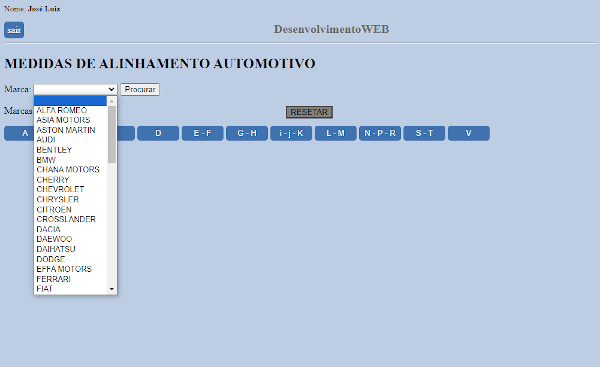
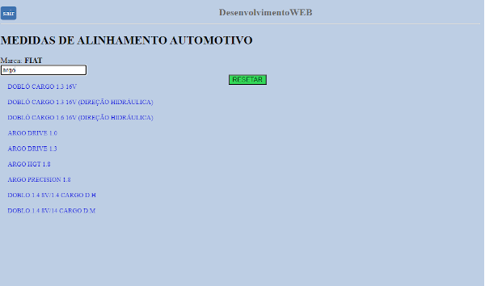
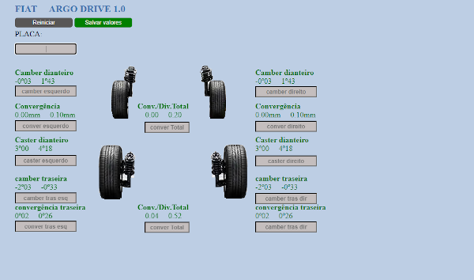
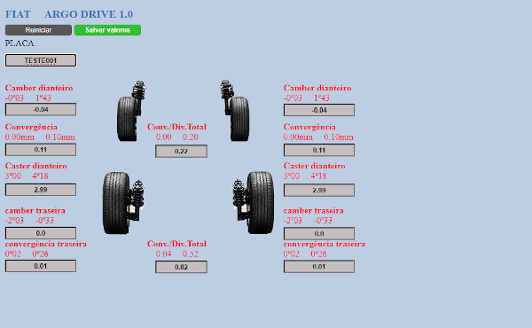
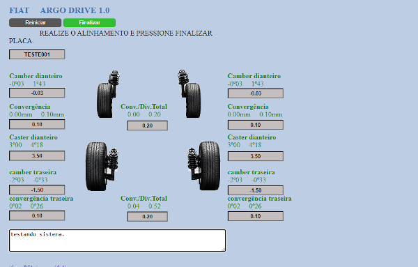
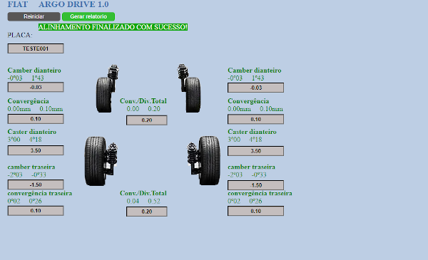
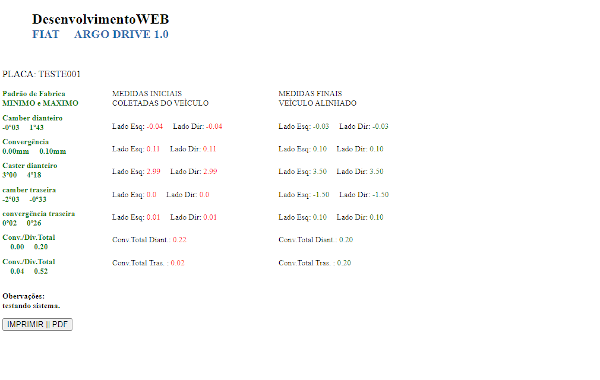
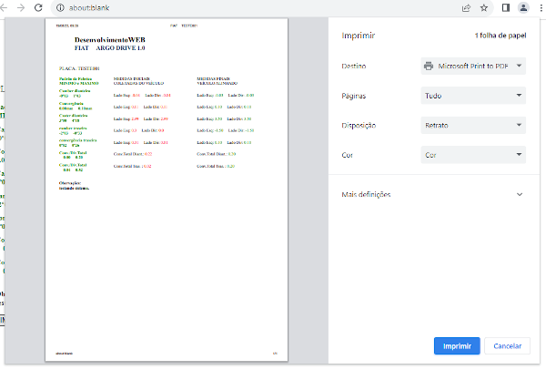

# AlinhamentoAutomotivo
Projeto proprio.
Tecnologias utilizadas: JavaScript, Php, Mysql ,Html5, css3 
## Sistema com medidas para alinhamento automotivo
## https://abbacarservice.com.br/alinhamento

Sistema consome base de dados json com dados das medidas de
alinhamnto de cada veiculo.

Por fim gera relatório com medidas iniciais e medidas finais
veiculo já alinhado.

## https://abbacarservice.com.br/alinhamento
Para testar projeto entre em contado 
através :
https://jose85luiz-portifolio.pro/
